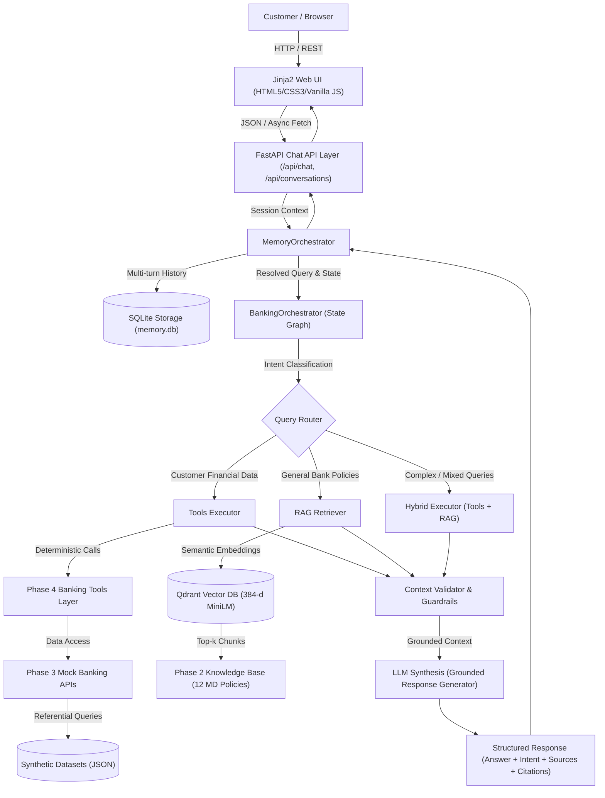

# NovaBank AI-Powered Banking Customer Query Assistant
## Comprehensive Project Approach & Phase-by-Phase Implementation Document

---

## 1. Executive Summary & Vision

The **NovaBank AI-Powered Banking Customer Query Assistant** is an enterprise-grade conversational AI platform designed to deliver safe, grounded, context-aware banking assistance. Built for a fictional modern Indian commercial bank (**NovaBank**), the assistant handles customer-specific financial queries (balances, transaction histories, loan details, EMI estimations) and general banking inquiries (product criteria, interest rates, fraud/security protocols, FAQs).

The architecture is driven by a non-negotiable core philosophy:
1. **Zero Hallucination for Financial Facts:** LLMs are never allowed to fabricate balances, transactions, account numbers, or loan statuses. All factual records are fetched deterministically via structured tools and verified repositories.
2. **Strict Customer Data Isolation:** All session history, tools, and queries are strictly bound to authenticated customer IDs (`CUST001`–`CUST010`). Cross-customer context leakage is impossible by design.
3. **Grounded RAG for Bank Policies:** Knowledge-base answers must be backed by cited bank policies retrieved semantically from vector storage.
4. **Spec-Driven Development (SDD):** Every component was specified in complete markdown specifications before code implementation, accompanied by automated regression testing (241 passing unit/integration tests).

---

## 2. End-to-End System Architecture



---

## 3. Phase-by-Phase Detailed Breakdown

The project was executed across ten sequential, modular phases. Below is the detailed account of what was done in each phase, why it was done, the artifacts created, and how each phase was verified.

---

### Phase 1 — Synthetic Banking Data Generation & Preprocessing

* **Objective:** Establish a referentially sound, compliant, and realistic Indian banking dataset with simulated customer queries without using real PII.
* **Why This Phase Was Done First:** Real banking data contains sensitive PII and financial secrecy constraints. Before developing APIs, tools, or agents, the system required deterministic, high-quality data modeling Indian accounts, loans, and transaction histories.
* **What We Built & Implemented:**
  1. **Core Datasets (`data/`):**
     * `customers.json`: 10 synthetic NovaBank customers (`CUST001`–`CUST010`) featuring realistic Indian names, PAN numbers, Aadhaar IDs, credit scores (600–810), incomes, and consent flags.
     * `accounts.json`: 15–20 bank accounts covering Savings, Current, and Salary accounts with opening dates, balances, and operational statuses.
     * `transactions.json`: ~1,500 transactions distributed across 12 months with authentic debit/credit logic, categories (Food, Utilities, Travel, Shopping), and merchant names.
     * `loans.json`: 12 active/closed loans across Home, Personal, Education, and Vehicle loans with principal amounts, interest rates, tenures, and EMIs.
     * `products.json`: Catalog of NovaBank retail offerings (FDs, Savings accounts, Credit cards, and Loan schemes).
     * `customer_profiles.json`: Banking preferences, KYC statuses, preferred channels, and risk profiles.
     * `customer_query_logs.txt`: 200+ simulated conversational queries categorized by intent.
     * `query_labels.json` & `processed_queries.json`: Intent-tagged and tokenized queries.
  2. **Generation & Verification Scripts (`scripts/`):**
     * `scripts/generate_data.py`: Deterministic data generator enforcing balance consistency.
     * `scripts/preprocess_queries.py`: Tokenizes user queries and maps intent classes.
     * `scripts/validate_data.py`: Validates schema integrity, foreign keys, and currency bounds.
* **Testing & Integrity:** Validated using `validate_data.py` to ensure 100% referential integrity (every transaction points to a valid account and customer, account balances reflect historical credits and debits).

---

### Phase 2 — NovaBank Knowledge Base & Policy Documentation

* **Objective:** Author authoritative, comprehensive banking policy manuals and general FAQs to serve as the factual ground truth for general customer queries.
* **Why This Phase Was Done:** LLMs hallucinate interest rates, penalty charges, and eligibility rules if relying on open-ended training data. Grounded RAG requires curated bank policies with unambiguous terms.
* **What We Built & Implemented:**
  1. **12 Policy Documents (`knowledge_base/`):**
     * `01_home_loan_policy.md`: Eligibility, LTV ratios, interest brackets, prepayment rules.
     * `02_personal_loan_policy.md`: Unsecured personal loans, processing fees, documentation.
     * `03_education_loan_policy.md`: Moratorium periods, co-applicant criteria, overseas courses.
     * `04_vehicle_loan_policy.md`: Two-wheeler and four-wheeler financing, hypothecation rules.
     * `05_credit_card_policy.md`: Card tiers (Silver, Gold, Platinum), interest-free days, billing.
     * `06_savings_account_policy.md`: Minimum Average Balance (MAB), interest rates, tier limits.
     * `07_fixed_deposit_policy.md`: Tenures (7 days to 10 years), senior citizen bonuses, TDS rules.
     * `08_transaction_policy.md`: UPI/NEFT/RTGS/IMPS limits, chargeback timelines, cooldown periods.
     * `09_account_management_policy.md`: KYC updates, nomination, branch changes, dormancy revival.
     * `10_fraud_and_security_policy.md`: Card blocking, unauthorized transaction reporting, RBI zero liability rules.
     * `11_customer_service_policy.md`: Grievance redressal hierarchy, Banking Ombudsman timelines.
     * `12_general_banking_faq.md`: 50+ common customer questions and official answers.
     * `metadata.json`: Policy categorization, version numbers, effective dates.
  2. **Validation Tooling:**
     * `scripts/validate_knowledge_base.py`: Linting and structural validation checking header hierarchies, explicit fee tables, and regulatory disclaimers.

---

### Phase 3 — Mock Banking API Layer

* **Specification:** `specs/03_banking_api_spec.md`
* **Objective:** Expose clean, RESTful banking micro-APIs over the synthetic data using FastAPI, adhering to strict Spec-Driven Development.
* **Why This Phase Was Done:** Decouples raw data files from upper layers and provides standard HTTP endpoints that emulate core banking backend systems (CBS).
* **What We Built & Implemented:**
  1. **Repositories & Schemas (`app/repositories/`, `app/schemas/`):**
     * Pydantic schemas enforcing strict types, serialization, and input validations.
     * JSON file-backed repositories providing deterministic query filtering, sorting, and pagination without introducing heavyweight external DBMS dependencies.
  2. **REST Endpoints (`app/api/`):**
     * `GET /api/customers/{id}`: Customer KYC and demographics.
     * `GET /api/accounts`: Accounts for a customer with balance lookups.
     * `GET /api/transactions`: Historical debits/credits with date range and category filtering.
     * `GET /api/loans`: Customer loan portfolio and EMI status.
     * `GET /api/products`: Bank retail product catalog.
     * `GET /api/health`: System status and dataset accessibility checks.
* **Verification & Tests:**
  * Tests: `tests/test_customers.py`, `tests/test_accounts.py`, `tests/test_transactions.py`, `tests/test_loans.py`, `tests/test_products.py`, `tests/test_api_errors.py`, `tests/test_security_isolation.py`.
  * Verified 404 handling, invalid customer ID rejection, query parameter boundaries, and security isolation.

---

### Phase 4 — Structured Banking Tools Layer

* **Specification:** `specs/04_banking_tools_spec.md`
* **Objective:** Package the Phase 3 banking APIs into structured, deterministic Python tools ready for AI agent consumption, without containing any LLM logic.
* **Why This Phase Was Done:** Agents require strongly-typed, callable function interfaces with strict argument schemas and deterministic error contracts. Agents should never construct arbitrary database queries or unverified API requests.
* **What We Built & Implemented:**
  1. **Tool Implementations (`app/tools/banking_tools.py`):**
     * `get_customer_profile`: Fetches demographic, contact, and KYC information.
     * `get_account_balance`: Returns verified live balances for specific or all accounts.
     * `get_account_details`: Returns branch IFSC, status, and account type.
     * `get_transaction_history`: Retrieves structured transactions with limit, date range, and category filters.
     * `get_active_loans`: Pulls active loan contracts, outstanding balances, and next EMI dates.
     * `calculate_loan_emi`: Mathematical amortization calculator for principal, tenure, and interest rate.
     * `get_product_catalog`: Searches retail banking products by category.
  2. **Security & Boundary Enforcement:**
     * Mandatory `customer_id` parameter verification ensuring an authenticated customer can only query their own accounts.
     * Standardized JSON success and error dictionary returns.
* **Verification & Tests:**
  * `tests/test_banking_tools.py` (35 test cases covering all tool operations and mathematical accuracy).
  * `tests/test_banking_tool_security.py` (cross-customer data isolation and unauthorized query rejections).

---

### Phase 5 — RAG Pipeline & Vector Search

* **Specification:** `specs/05_rag_pipeline_spec.md`
* **Objective:** Build an autonomous semantic retrieval engine indexing the Phase 2 banking knowledge base into a local vector store.
* **Why This Phase Was Done:** General customer queries (e.g., "What are the foreclosure charges for a home loan?") require accurate textual retrieval from bank policies without hallucinating clauses.
* **What We Built & Implemented:**
  1. **Markdown Header-Aware Chunker (`app/rag/chunker.py`):**
     * Respects markdown headings (`#`, `##`, `###`), preserving section hierarchy and breadcrumbs.
     * Attaches metadata: document title, section heading, policy category, and chunk token length.
  2. **Embedding Pipeline (`app/rag/embeddings.py`):**
     * Employs `sentence-transformers` (`all-MiniLM-L6-v2`, 384 dimensions) for local, fast semantic vectorization.
  3. **Vector Storage (`app/rag/vector_store.py`):**
     * Local embedded **Qdrant** client (`qdrant_storage/`), eliminating external cloud dependencies.
     * Cosine similarity index with metadata filtering capabilities.
  4. **Retriever (`app/rag/retriever.py`):**
     * Top-k semantic retrieval with confidence score thresholding.
     * Generates structured `RetrievalResult` objects containing raw text and policy citations.
  5. **Indexing Tooling:**
     * `scripts/build_rag_index.py`: Automates ingestion, chunking, and Qdrant collection upsert.
     * `scripts/inspect_rag.py`: Interactive CLI to test vector search queries and similarity scores.
* **Verification & Tests:**
  * `tests/test_rag_loader.py`, `tests/test_rag_chunking.py`, `tests/test_rag_embeddings.py`, `tests/test_rag_vector_store.py`, `tests/test_rag_retrieval.py`.
  * Verified chunk overlap, embedding consistency, Qdrant payload filters, and retrieval relevance.

---

### Phase 6 — Multi-Agent Orchestrator & Reasoning Layer

* **Specification:** `specs/06_agents_orchestrator_spec.md`
* **Objective:** Implement the central AI reasoning engine that analyzes customer intent, routes requests between Banking Tools and RAG, executes retrieval, and synthesizes grounded answers.
* **Why This Phase Was Done:** Customers ask diverse queries—some purely transactional ("What is my balance?"), some purely educational ("What are your FD interest rates?"), and some hybrid ("Can I afford a personal loan with my current balance and salary?"). The system needs an intelligent dispatcher and synthesizer.
* **What We Built & Implemented:**
  1. **State Machine Orchestrator (`app/agents/orchestrator.py`, `app/agents/state.py`):**
     * Implements a LangGraph-compatible state transition graph:
       $$\text{Input Query} \longrightarrow \text{Router} \longrightarrow [\text{Tools} \mid \text{RAG} \mid \text{Hybrid}] \longrightarrow \text{Validator} \longrightarrow \text{Generator} \longrightarrow \text{Final Output}$$
  2. **Query Router (`app/agents/router.py`):**
     * Intent classifier assigning queries to:
       - `BANKING_TOOLS`: Account queries, balances, transactions, customer loans.
       - `RAG`: Policy guidelines, FAQs, interest rates, terms & conditions.
       - `HYBRID`: Queries requiring both customer data and policy criteria.
  3. **Execution Nodes (`app/agents/tools_executor.py`, `app/agents/rag_executor.py`):**
     * Executes relevant tool calls deterministically or retrieves top-k knowledge-base chunks.
  4. **Context Validator & Anti-Hallucination Guardrails (`app/agents/context_validator.py`):**
     * Validates that all numbers, account IDs, and facts in the generated response exist within the retrieved tool data or RAG context.
     * Refusal trigger: Politely declines to answer if factual data is absent rather than guessing.
  5. **Response Generator & Prompts (`app/agents/response_generator.py`, `app/agents/prompts.py`, `app/agents/llm.py`):**
     * Synthesizes professional, empathetic banking answers formatted in markdown with explicit source citations.
* **Verification & Tests:**
  * `tests/test_router.py`, `tests/test_orchestrator.py`, `tests/test_tool_routing.py`, `tests/test_rag_routing.py`, `tests/test_mixed_queries.py`, `tests/test_response_grounding.py`, `tests/test_agent_security.py`, `tests/test_agent_state.py`.

---

### Phase 7 — Conversation Memory & Session State

* **Specification:** `specs/07_conversation_memory_spec.md`
* **Objective:** Introduce session-scoped conversation history in SQLite to support multi-turn dialogue, anaphora resolution, and contextual follow-ups.
* **Why This Phase Was Done:** Stateless chatbots fail when users ask follow-up questions (e.g., User: "What is my savings balance?" -> Assistant: "INR 1,25,000" -> User: "What about my recent debits from it?"). The assistant must remember previous turns.
* **What We Built & Implemented:**
  1. **SQLite Storage Engine (`app/memory/sqlite_memory.py`):**
     * Embedded SQLite database (`memory.db`) with schema migrations for conversations, messages, and turn metadata.
     * Thread-safe connection handling and index optimization on `conversation_id` and `customer_id`.
  2. **Memory Models & Interfaces (`app/memory/models.py`, `app/memory/interface.py`):**
     * Pydantic data models for `Conversation`, `Message`, and `MessageRole` (`USER`, `ASSISTANT`, `SYSTEM`).
  3. **Memory Orchestrator (`app/memory/memory_orchestrator.py`):**
     * Bridges conversational history into the Phase 6 `BankingOrchestrator`.
     * Sliding context window to keep prompt token consumption bounded.
     * Pronoun and reference resolution across message turns.
  4. **Strict Security Isolation (`CustomerMismatchError`):**
     * Explicit verification preventing any conversation created for Customer A from being accessed or updated by Customer B.
* **Verification & Tests:**
  * `tests/test_sqlite_memory.py`, `tests/test_memory_models.py`, `tests/test_memory_orchestrator.py`, `tests/test_memory_history.py`, `tests/test_memory_persistence.py`, `tests/test_memory_isolation.py`.
  * Verified database persistence across restarts and cross-customer query rejections.

---

### Phase 8 — RESTful Chat & Conversation API Layer

* **Specification:** `specs/08_chat_api_spec.md`
* **Objective:** Expose the complete memory-aware banking assistant via production-grade FastAPI endpoints.
* **Why This Phase Was Done:** Frontends (web apps, mobile apps, IVR) need clean, standardized REST APIs with predictable status codes and structured payloads.
* **What We Built & Implemented:**
  1. **Conversation Endpoints (`app/api/conversations.py`):**
     * `POST /api/conversations`: Creates a new session tied to `customer_id`.
     * `GET /api/conversations/{conversation_id}`: Retrieves complete message history.
     * `GET /api/conversations`: Lists conversations for a customer.
  2. **Chat Interaction Endpoint (`app/api/chat.py`):**
     * `POST /api/chat`: Receives `conversation_id`, `customer_id`, and `message`.
     * Triggers `MemoryOrchestrator` -> `BankingOrchestrator`.
     * Returns structured JSON containing:
       - `response`: Assistant natural language message.
       - `intent`: Classified intent (`BANKING_TOOLS`, `RAG`, or `HYBRID`).
       - `sources`: Cited knowledge base files and sections.
       - `tool_calls`: Summary of tools invoked during processing.
  3. **Global Error Handling & Health (`app/main.py`, `app/api/health.py`):**
     * Centralized exception handlers converting domain exceptions (`ConversationNotFoundError`, `CustomerMismatchError`, `InvalidMessageError`) into clean RFC-compliant HTTP error responses.
     * Multi-component health checks for SQLite, Qdrant, and repositories.
* **Verification & Tests:**
  * `tests/test_chat_api.py`, `tests/test_conversation_api.py`, `tests/test_health_api.py`, `tests/test_docs.py`.

---

### Phase 9 — Jinja2 Web UI & User Experience

* **Specification:** `specs/09_jinja_ui_spec.md`
* **Objective:** Deliver a responsive, modern web interface allowing end users and evaluators to interact seamlessly with NovaBank's assistant.
* **Why This Phase Was Done:** An AI assistant requires an intuitive, accessible visual interface for testing real-world multi-turn conversational flows and provenance inspection.
* **What We Built & Implemented:**
  1. **Jinja2 Frontend Architecture (`app/templates/index.html`):**
     * Single-page responsive layout served directly by FastAPI.
     * Sidebar for active conversations, customer selection, and status indicators.
     * Main conversation pane with dynamic scrolling, message input, and action triggers.
  2. **Modern Banking Design System (`app/static/css/`):**
     * Curated palette: NovaBank Navy (`#0F172A`), Emerald Green (`#10B981`), Crisp Slate (`#F8FAFC`).
     * Glassmorphism headers, responsive message bubbles with markdown formatting, and animations.
     * Mobile-friendly responsive breakpoints.
  3. **Vanilla JavaScript Client (`app/static/js/`):**
     * Lightweight, zero-dependency async client interacting with Phase 8 REST endpoints.
     * Features:
       - Real-time customer switcher (`CUST001`–`CUST010`) with automatic session loading.
       - Interactive sample query pills (e.g., "Check my balance", "Explain Home Loan Foreclosure", "Show recent transactions").
       - Dynamic typing indicator during asynchronous AI synthesis.
       - Provenance inspector: Expands to display cited policy documents or executed banking tools.
       - Error toast notifications for network drops or session timeouts.
* **Verification & Tests:**
  * `tests/test_ui.py`: Template rendering, static asset availability, and root route tests.
  * `tests/test_ui_chat_flow.py`: End-to-end conversation creation and multi-turn message handling via UI endpoints.
  * `tests/test_ui_errors.py`: Frontend error handling validation for missing fields and disconnected sessions.

---

### Phase 10 — Evaluation, Benchmarking & Continuous Optimization (Current / Next Phase)

* **Specification:** `specs/10_evaluation_optimization_spec.md`
* **Objective:** Establish formal evaluation frameworks, quantitative RAG metrics, latency benchmarks, and anti-hallucination stress tests.
* **Why This Phase Is Planned:** Enterprise banking systems require rigorous quantitative validation before production deployment. Subjective testing must be replaced with measurable KPIs.
* **Key Focus Areas:**
  1. **RAG Retrieval Quality (RAGAS / Trulens metrics):**
     - **Context Precision & Recall:** Ensuring retrieved knowledge-base chunks accurately cover user questions.
     - **Hit Rate @ K & Mean Reciprocal Rank (MRR):** Measuring top-k ranking accuracy across the 200+ simulated queries.
  2. **Response Grounding & Faithfulness (LLM-as-a-Judge):**
     - **Faithfulness Score:** Verifying that 100% of claims in assistant answers originate directly from context.
     - **Answer Relevance:** Measuring query-to-answer alignment and conciseness.
  3. **Deterministic Tool Accuracy:**
     - Amortization calculation correctness.
     - Date-bounded transaction filter accuracy.
  4. **Latency Profiling & Performance:**
     - Measuring end-to-end response time across pipeline stages (FastAPI overhead, SQLite read/write, Vector DB retrieval, and LLM inference).
     - P95 and P99 latency target definitions.
  5. **Adversarial & Safety Stress-Testing:**
     - Prompt injection defenses, jailbreak attempts, and cross-customer query probing.

---

## 4. Architectural Separation of Concerns

A pivotal achievement of the project is the clean separation between knowledge types and operational layers:

| Layer | Component | Source of Truth | Mutability / Behavior | LLM Dependency |
|---|---|---|---|---|
| **Factual Banking Data** | Phase 3 APIs & Phase 4 Tools | `data/*.json` | Deterministic, read-only | **None** (Zero LLM) |
| **Banking Policy Knowledge** | Phase 2 KB & Phase 5 RAG | `knowledge_base/*.md` & Qdrant | Semantic retrieval, top-k chunks | Embeddings only |
| **Conversation Memory** | Phase 7 SQLite Memory | `memory.db` | Stateful, session-isolated | **None** |
| **Orchestration & Reasoning** | Phase 6 Multi-Agent Engine | State Graph & Router | Dynamic routing & validation | Router & Synthesis |
| **API & Delivery** | Phase 8 Chat API | FastAPI routers | Stateless HTTP layer | **None** |
| **Presentation** | Phase 9 Jinja UI | Jinja2, HTML5, CSS3, JS | Client browser interaction | **None** |

---

## 5. Technology Stack Summary

| Domain | Technology / Library | Purpose |
|---|---|---|
| **Backend Framework** | FastAPI (Python 3.11+) | Asynchronous HTTP endpoints, API routing, exception handling |
| **Data Validation** | Pydantic v2 | Strict schema parsing, serialization, and input validation |
| **Vector Database** | Qdrant (Local Storage Mode) | Embedded vector storage for semantic policy chunk indexing |
| **Embeddings** | SentenceTransformers (`all-MiniLM-L6-v2`) | Local, 384-dimensional dense semantic vectors |
| **Relational Memory** | SQLite3 (`sqlite_memory.py`) | Local zero-configuration multi-turn session persistence |
| **Agent Orchestration** | LangGraph / State Graph Architecture | Graph-based intent routing, tool calling, and validation |
| **User Interface** | Jinja2, HTML5, Vanilla CSS3, Vanilla JS | Interactive banking web portal with no heavyweight npm build |
| **Testing & Quality** | Pytest, Pytest-AsyncIO, Starlette TestClient | Automated unit, integration, and security test suites |

---

## 6. Comprehensive Test Suite & Quality Verification

The system maintains a comprehensive test suite of **241 automated tests across 36 test modules**, with a 100% pass rate:

```text
============================= test session starts =============================
platform win32 -- Python 3.12.10, pytest-9.0.2, pluggy-1.6.0
collected 241 items

Phase 3 & API Tests:
  tests/test_customers.py                  (5 passed)
  tests/test_accounts.py                   (6 passed)
  tests/test_transactions.py               (13 passed)
  tests/test_loans.py                      (12 passed)
  tests/test_products.py                   (4 passed)
  tests/test_api_errors.py                 (12 passed)
  tests/test_health_api.py                 (2 passed)
  tests/test_docs.py                       (4 passed)

Phase 4 Banking Tools & Security Tests:
  tests/test_banking_tools.py              (35 passed)
  tests/test_banking_tool_security.py      (7 passed)

Phase 5 RAG Pipeline Tests:
  tests/test_rag_loader.py                 (4 passed)
  tests/test_rag_chunking.py               (4 passed)
  tests/test_rag_embeddings.py             (5 passed)
  tests/test_rag_vector_store.py           (9 passed)
  tests/test_rag_retrieval.py              (9 passed)

Phase 6 Agents & Orchestrator Tests:
  tests/test_router.py                     (7 passed)
  tests/test_tool_routing.py               (5 passed)
  tests/test_rag_routing.py                (3 passed)
  tests/test_mixed_queries.py              (2 passed)
  tests/test_orchestrator.py               (7 passed)
  tests/test_response_grounding.py         (4 passed)
  tests/test_agent_security.py             (5 passed)
  tests/test_agent_state.py                (2 passed)
  tests/test_security_isolation.py         (4 passed)

Phase 7 Conversation Memory Tests:
  tests/test_sqlite_memory.py              (11 passed)
  tests/test_memory_models.py              (7 passed)
  tests/test_memory_orchestrator.py        (10 passed)
  tests/test_memory_history.py             (6 passed)
  tests/test_memory_persistence.py         (1 passed)
  tests/test_memory_isolation.py           (5 passed)

Phase 8 Chat API Tests:
  tests/test_conversation_api.py           (8 passed)
  tests/test_chat_api.py                   (9 passed)

Phase 9 Jinja UI Tests:
  tests/test_ui.py                         (6 passed)
  tests/test_ui_chat_flow.py               (3 passed)
  tests/test_ui_errors.py                  (5 passed)

======================= 241 passed, 1 warning in 39.64s =======================
```

---

## 7. Project Progression & Status Matrix

| Phase | Title | Status | Primary Output Files |
|:---:|---|:---:|---|
| **01** | Synthetic Banking Data | **Completed** | `data/*.json`, `scripts/generate_data.py`, `scripts/validate_data.py` |
| **02** | Knowledge Base Policies | **Completed** | `knowledge_base/*.md` (12 policies), `scripts/validate_knowledge_base.py` |
| **03** | Mock Banking APIs | **Completed** | `app/api/` (accounts, transactions, loans, products), `specs/03_*.md` |
| **04** | Banking Tools Layer | **Completed** | `app/tools/banking_tools.py`, `specs/04_*.md` |
| **05** | RAG Pipeline & Vector Search | **Completed** | `app/rag/` (retriever, chunker, vector store), `specs/05_*.md` |
| **06** | Agents & Orchestrator | **Completed** | `app/agents/` (orchestrator, router, validator), `specs/06_*.md` |
| **07** | Conversation Memory | **Completed** | `app/memory/` (sqlite_memory, memory_orchestrator), `specs/07_*.md` |
| **08** | Chat & Conversation API | **Completed** | `app/api/chat.py`, `app/api/conversations.py`, `specs/08_*.md` |
| **09** | Jinja2 Web UI | **Completed** | `app/templates/index.html`, `app/static/`, `specs/09_*.md` |
| **10** | Evaluation & Optimization | **In Progress / Next** | `specs/10_evaluation_optimization_spec.md` |

---

## 8. Summary of Outcomes & Highlights

1. **Zero Financial Hallucination:** Factual numbers are extracted deterministically by dedicated tool functions, not hallucinated by LLM generation.
2. **Context-Grounding & Evidence Attribution:** General banking answers provide explicit citations back to the authoritative NovaBank policy manual.
3. **Session Privacy & Security:** Full customer data isolation is baked into memory models, API paths, and agent tools.
4. **Developer Experience & Maintainability:** Spec-Driven Development coupled with modular architecture guarantees that any subsystem (vector database, memory storage, UI, or tools) can be tested or upgraded in isolation.
